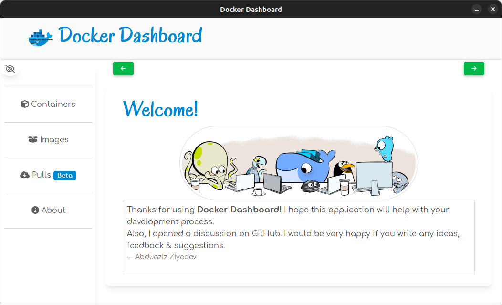
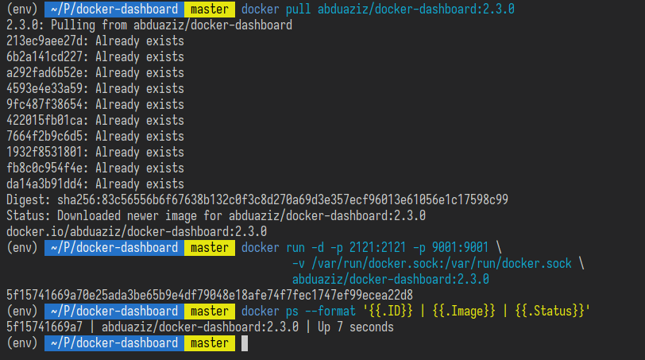
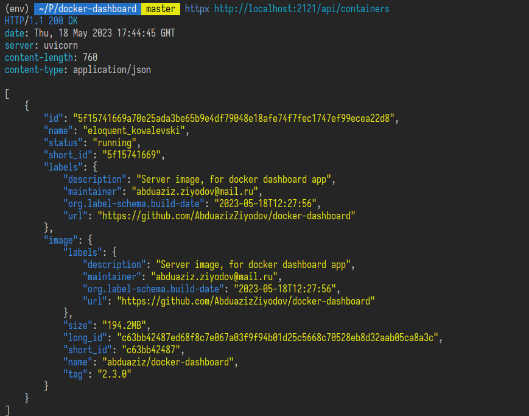

# 🐳 **Docker Dashboard**

<p align="center">
  <picture>
    <source media="(prefers-color-scheme: dark)" srcset="https://abduaziz.ziyodov.uz/badges/ai-free-dark.svg">
    <source media="(prefers-color-scheme: light)" srcset="https://abduaziz.ziyodov.uz/badges/ai-free-light.svg">
    
  </picture>
</p>



> **_Simple lightweight GUI application for working with Docker!_**


## **📄 System Requirements**:

- Docker
- Operating system: `ubuntu` (tested `20.04 LTS`, `22.04 LTS`).

## **📦 Installation**

## **Server** 🚀

I changed the way of installing server-side components. You don't need to install anything on your local machine.

First, you need to pull the docker image:

> **Note**
> In this readme I used `tagname`, which you can find from releases section (e.g 2.4.0).

```sh
docker pull abduaziz/docker-dashboard:tagname
```

Now it is ready to run, but the docker-dashboard needs access to your local docker UNIX socket. Because it cannot get any data from your docker host, from inside of the container (it is an isolated environment). You have to pass your docker socket path through `-v`.

> **Note**
> You have to run the docker image on the `2121` port because the client-side application listens on this port. Port `9001` is for the supervisor `inet HTTP server`, it is optional but if you want, you can expose this port.

```sh
docker run -d -p 2121:2121 -p 9001:9001 \
    -v /var/run/docker.sock:/var/run/docker.sock \
    abduaziz/docker-dashboard:tagname
```



Visit http://localhost:2121 🎉



## **Client** 👨‍🦰

Go to the [releases](https://github.com/AbduazizZiyodov/docker-dashboard/releases). Download the latest version according to your operating system.

- **Ubuntu**
  ```sh
  sudo dpkg -i docker-dashboard_*.deb
  ```

> **Warning**
> I uploaded `.dmg`, `.AppImage` packages also, you can test them. But they are not stable!

## **🔧 Development**

Clone this repository

```sh
$ git clone https://github.com/AbduazizZiyodov/docker-dashboard
```

**Running 🚀**

- `backend` (from src/):
  ```sh
  make run
  ```
- `tests` (from parent dir)
  ```sh
  # install test requirements from test_requirements.txt
  $ make test
  ```
- `frontend` (from src/client)
  ```sh
  npm start # or ng serve (global)
  ```

## **🏗️ Build**

First, you have to install some system dependencies,`rust` and `cargo`, then `tauri` itself. You can see all instructions from tauir's documentation.

**References**

- https://tauri.app/v1/guides/getting-started/prerequisites/
- https://tauri.app/v1/guides/getting-started/setup/integrate
- https://tauri.app/v1/guides/development/development-cycle
- https://doc.rust-lang.org/cargo/getting-started/installation.html

You can run client-side (preview) by this command:

```sh
cargo tauri dev
```

Build client-side. You should check `src/client/src-tauri/target` folder:

```sh
cargo tauri build
```

# **License**

This project is licensed under the terms of the MIT license.

<hr>

<p align='center'>
    Author: <strong>Abduaziz Ziyodov</strong> 
</p>
