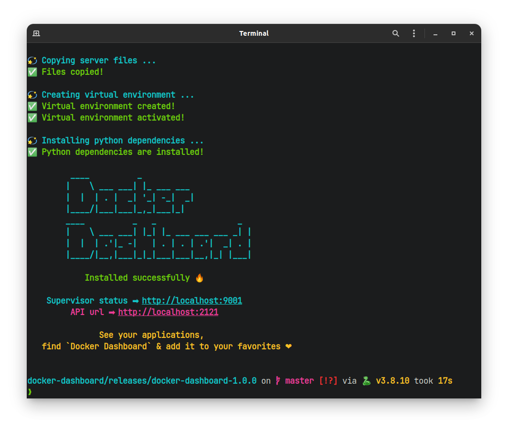
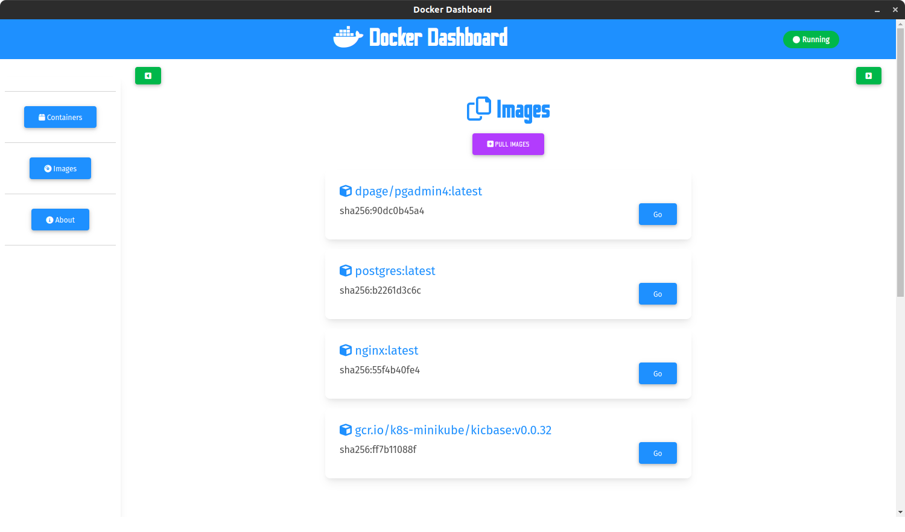

# 🐳 **Docker Dashboard**

**Demo**: https://youtu.be/xIqG1UuwfXU

> _A simple lightweight application that makes managing containers & images on Docker easy!_

<blockquote>
    Perhaps it can be a good alternative to Docker Desktop in the future 😂
    <figcaption>- Abduaziz Ziyodov, <cite>author</cite></figcaption>
</blockquote>

**Requirements**:

- Python +3.8
- Operating system: `ubuntu` (tested +20.04 LTS).

## **Installation**

Go to the [releases](https://github.com/AbduazizZiyodov/docker-dashboard/releases). Download the latest version (`docker-dashboard-*.tar.gz`) and extract archive.

```bash
$ mkdir docker-dashboard/
$ tar -xf docker-dashboard-*.tar.gz  -C docker-dashboard/
```

Open the directory on the terminal and run this command:

```bash
$ cd docker-dashboard/
$ sudo python3 install.py
```





## **Development**

Clone this repository

```bash
$ git clone https://github.com/AbduazizZiyodov/docker-dashboard
```

Running:

- `backend` (src/server):
  ```bash
  $ python3 manage.py serve
  ```
- `tests` (src/server/tests)
  ```bash
  $ pytest
  ```
- `frontend` (src/client)
  ```bash
  $ ng serve
  ```

### **Build**

Building debian package:

```bash
$ cd docker-dashboard/src/client
$ sudo ./build_linux.sh
```


Then, for full installation run `install.py`

```bash
$ sudo python3 install.py
```


- **Supervisor status**:
  

- **API status**:
  

## **Testing**

Used `pytest`, (tests -> src/server/tests)

```bash
$ cd src/server
$ pytest
```


<hr>

<p align='center'>
    Author: <strong>Abduaziz Ziyodov</strong> 
</p>
